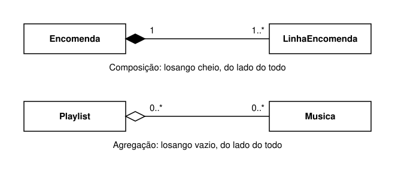

# Reunir artigos num inventário: relações entre objetos, composição e UML leve

*M10 · Caderno 4*

No caderno 3, cada artigo aprendeu a proteger a sua quantidade. Recusa um pedido impossível com `ValueError` e, quando recusa, deixa os dados exatamente como estavam. Um inventário, porém, não é um artigo sozinho: é um conjunto de artigos. E há perguntas sobre esse conjunto que nenhum artigo consegue responder por si. Que artigos existem? Há dois artigos com o mesmo código? Quantas unidades tem o artigo com o código A02? Para responder a estas perguntas precisamos de um objeto novo, o inventário, que reúne os artigos e fala com eles.

Este caderno trata das relações entre objetos. Vamos ver que há duas perguntas muito diferentes que se podem fazer sobre duas classes: "uma tem a outra?" e "uma é um caso da outra?". Vamos aprender a desenhar classes e as ligações entre elas com uma forma simplificada de UML, uma linguagem de diagramas usada no mundo inteiro para descrever programas. Vamos distinguir dois graus da relação "tem", a composição e a agregação, que em UML se desenham com um losango cheio e com um losango vazio. E vamos escrever, passo a passo, a classe `Inventario` em Python.

## Antes de começares

Este caderno usa a classe `Artigo` tal como ficou no fim do caderno 3: a propriedade `quantidade`, com getter e setter, os métodos `adicionar` e `retirar` com contrato, e as exceções `ValueError`, lançadas com `raise` e tratadas com `try` e `except`. Se alguma destas ideias ainda estiver pouco firme, volta ao caderno 3 antes de continuares, sobretudo às secções 7 a 12. Tudo o resto que o caderno usa é explicado aqui.

Usa também duas ferramentas do Python que provavelmente já usaste no 10.º ano: as listas e o ciclo `for`. Como vamos usá-las de uma maneira nova, para guardar objetos, a secção 9 explica-as do princípio antes de lhes darmos trabalho.

Os programas completos correm sozinhos, como nos cadernos anteriores: copia-os para um ficheiro `.py` e executa o ficheiro inteiro. Os excertos estão sempre assinalados e o texto diz de que outro código dependem. O [laboratório](04-composicao-modelacao-laboratorio.md) acompanha-te, passo a passo, na construção do inventário no computador, e a [ficha de exercícios](04-composicao-modelacao-exercicios.md) serve para praticares sozinho depois de estudares este caderno.

Para os programas não ficarem demasiado compridos, a classe `Artigo` aparece neles com as docstrings mais curtas do que no caderno 3. As instruções são exatamente as mesmas, e por isso o comportamento também é: as mesmas verificações, pela mesma ordem, com as mesmas mensagens.

## 1. Artigos soltos: o que nenhum artigo consegue garantir

Começamos com três artigos criados a partir da classe final do caderno 3, cada um no seu nome. Programa completo:

```python
class Artigo:
    """Artigo do inventário: código, nome e uma quantidade sempre válida.

    É a classe final do caderno 3, com as docstrings encurtadas.
    """

    def __init__(self, codigo, nome, quantidade):
        """Cria o artigo. A quantidade inicial passa pelo setter."""
        self.codigo = codigo
        self.nome = nome
        self.quantidade = quantidade

    @property
    def quantidade(self):
        """Getter: devolve a quantidade atual, sem a alterar."""
        return self._quantidade

    @quantidade.setter
    def quantidade(self, valor):
        """Setter: guarda o valor se for um inteiro não negativo; senão, lança ValueError."""
        if not isinstance(valor, int):
            raise ValueError("A quantidade tem de ser um número inteiro.")
        if valor < 0:
            raise ValueError("A quantidade não pode ser negativa.")
        self._quantidade = valor

    def adicionar(self, unidades):
        """Acrescenta unidades (inteiro, 1 ou mais); senão, lança ValueError."""
        if not isinstance(unidades, int):
            raise ValueError("As unidades a adicionar têm de ser um número inteiro.")
        if unidades <= 0:
            raise ValueError("As unidades a adicionar têm de ser 1 ou mais.")
        self.quantidade = self.quantidade + unidades

    def retirar(self, unidades):
        """Retira unidades (inteiro, 1 ou mais, até ao que existe); senão, lança ValueError."""
        if not isinstance(unidades, int):
            raise ValueError("As unidades a retirar têm de ser um número inteiro.")
        if unidades <= 0:
            raise ValueError("As unidades a retirar têm de ser 1 ou mais.")
        # A falta de unidades é recusada pelo setter: o resultado seria negativo.
        self.quantidade = self.quantidade - unidades


caderno = Artigo("A01", "Caderno", 6)
pasta = Artigo("A02", "Pasta", 2)
cola = Artigo("A01", "Cola", 3)

print(caderno.codigo, caderno.nome, caderno.quantidade)
print(pasta.codigo, pasta.nome, pasta.quantidade)
print(cola.codigo, cola.nome, cola.quantidade)
```

O programa mostra:

```text
A01 Caderno 6
A02 Pasta 2
A01 Cola 3
```

O Python aceitou os três artigos. As três quantidades são válidas, e o setter verificou cada uma delas. Mas o caderno e a cola ficaram com o mesmo código, A01. No caderno 1 escrevemos três regras para o inventário, e a primeira era esta: cada código identifica um único artigo. Esta regra acabou de ser quebrada, e nenhuma parte do programa deu por isso.

Podias pensar que bastava acrescentar uma verificação ao construtor do `Artigo`. Pensa, no entanto, no que o construtor sabe no momento em que a cola está a ser criada. Sabe o que recebeu nos parâmetros: `"A01"`, `"Cola"` e `3`. Sabe que `self` é o objeto novo, a cola. E não sabe mais nada. O caderno, criado duas linhas acima, é outro objeto, guardado num nome do programa principal, e nada dentro da classe `Artigo` lhe dá acesso a esse nome. Um artigo conhece os seus próprios dados, e só esses. Para saber se um código já está a ser usado é preciso conhecer todos os artigos, e nenhum artigo os conhece.

Há outras perguntas que ficam sem dono. Imagina que alguém escreve o código A02 e quer saber quantas unidades tem esse artigo. Tu sabes, ao ler o programa, que o artigo A02 está guardado no nome `pasta`. O programa não sabe: para ele, `pasta` é só um nome, e o código A02 está escondido dentro do objeto. Para encontrar o artigo a partir do código, o programa teria de comparar o código pedido com o código de cada artigo, um a um, numa cadeia de condições como esta. É um excerto: depende dos três artigos criados no programa acima.

```python partial
codigo_pedido = "A02"
if codigo_pedido == caderno.codigo:
    print(caderno.quantidade)
elif codigo_pedido == pasta.codigo:
    print(pasta.quantidade)
elif codigo_pedido == cola.codigo:
    print(cola.quantidade)
```

Cada artigo novo obrigaria a acrescentar um nome novo ao programa e uma condição nova a esta cadeia, escritos à mão. É o problema das variáveis soltas do caderno 1, agora um degrau acima. No caderno 1 eram o código, o nome e a quantidade que andavam soltos em variáveis separadas, e a classe `Artigo` juntou-os num objeto. Agora são os próprios artigos que andam soltos, em nomes separados, e a ligação entre eles só existe na cabeça de quem escreveu o programa.

A solução segue o mesmo caminho: juntar numa unidade aquilo que tem de estar junto. Vamos criar um objeto cuja tarefa é guardar os artigos todos e responder às perguntas sobre o conjunto. Esse objeto é o inventário.

## 2. Quem sabe o quê: responsabilidades

Antes de escrevermos a classe do inventário, temos de decidir o que fica a cargo dela e o que continua a cargo de cada artigo. Chamamos **responsabilidades** de uma classe ao que os seus objetos sabem e ao que fazem. Decidir as responsabilidades é decidir, para cada tarefa do programa, qual é a classe que fica encarregada dela.

Há uma regra simples que resolve a maior parte das decisões: uma tarefa fica com quem tem a informação necessária para a fazer. Aplicada ao nosso problema, dá esta tabela:

| Pergunta ou tarefa | Que informação é precisa | Quem a tem | Fica a cargo de |
| --- | --- | --- | --- |
| Quantas unidades tem este artigo? | A quantidade desse artigo | O próprio artigo | `Artigo` |
| Posso retirar 2 unidades deste artigo? | A quantidade e as regras dos pedidos | O próprio artigo | `Artigo` |
| Que artigos existem? | A lista de todos os artigos | Quem guarda todos | `Inventario` |
| Já existe um artigo com o código A01? | Os códigos de todos os artigos | Quem guarda todos | `Inventario` |
| Qual é o artigo com o código A02? | Os códigos de todos os artigos | Quem guarda todos | `Inventario` |

Repara que nenhuma linha passa do artigo para o inventário, nem ao contrário, sem uma razão. O inventário não fica a verificar se há unidades suficientes, porque essa regra já vive no artigo, e o caderno 3 mostrou o que custa escrever a mesma regra em dois sítios: basta mudá-la num sítio e esquecê-la no outro para o programa ficar incoerente. E o artigo não fica a verificar se o seu código é único, porque para isso teria de conhecer todos os outros artigos, e então cada artigo passaria a carregar o inventário inteiro dentro de si.

Separar responsabilidades não quer dizer que cada objeto trabalhe isolado. O inventário e os artigos vão colaborar. Quando alguém pedir ao inventário para retirar 2 unidades do artigo A01, o inventário encontra o artigo A01, porque conhece todos, e passa-lhe o pedido. O artigo decide se o pedido é possível, porque conhece a sua quantidade e as regras. Cada um faz a parte que sabe fazer. Na secção 10 vamos dar nome a esta passagem do pedido e escrevê-la em Python.

## 3. Duas perguntas sobre duas classes: "tem" e "é um"

Quando duas classes estão relacionadas, a primeira coisa a decidir é o tipo de relação. Há duas relações que aparecem constantemente e que convém nunca confundir.

A primeira é a relação **"tem"**. Um inventário tem artigos. Uma encomenda tem linhas. Uma turma tem alunos. É a relação entre um todo e as suas partes, ou entre um objeto e outros objetos que ele guarda e usa. Também se diz "contém" ou "é formado por".

A segunda é a relação **"é um"**. Um carro é um veículo. Uma bicicleta também é um veículo. É a relação entre um tipo particular e um tipo mais geral: tudo o que é verdade para qualquer veículo, por exemplo transportar pessoas de um sítio para outro, também é verdade para um carro. O carro é um caso particular de veículo, com mais pormenores.

A forma mais segura de decidir é dizer a frase em voz alta, com as duas classes, e ver se ela é verdadeira.

- "Um inventário tem artigos." Verdadeira.
- "Um inventário é um artigo." Falsa.
- "Um carro é um veículo." Verdadeira.
- "Um carro tem um motor." Verdadeira, e repara que o motor não é um carro nem o carro é um motor.

Às vezes a frase "é um" parece quase verdadeira, e é preciso um teste mais cuidadoso. O teste é este: se A é um B, então tudo o que um B tem e tudo o que um B faz tem de fazer sentido para um A. Vamos aplicá-lo à frase "um inventário é um artigo". Um artigo tem um código, um nome e uma quantidade. Qual seria a quantidade de um inventário? O inventário tem artigos com 6, 2 e 10 unidades, de materiais diferentes, e não há um número que seja "a quantidade do inventário". Um artigo aceita o pedido "retirar 2 unidades". Retirar 2 unidades de um inventário, sem dizer de que artigo, não quer dizer nada. O teste falha, e por isso o inventário não é um artigo.

O erro típico é pensar que o inventário é "um artigo maior, com muitos artigos lá dentro". Essa ideia mistura as duas relações: ter coisas lá dentro não faz de ninguém uma dessas coisas. Uma mochila tem cadernos, mas não é um caderno. Uma biblioteca tem livros, mas não se lê uma biblioteca de uma ponta à outra como se lê um livro.

Esta distinção vai ser muito importante no caderno 5, onde vais aprender a herança, que é a forma de escrever a relação "é um" em código. Quem usa herança numa relação que é afinal "tem" acaba com classes que oferecem operações sem sentido, como um inventário com uma quantidade própria e um método para retirar unidades sem dizer de que artigo. Antes de ligares duas classes, diz a frase. Se "é um" soar falso, não é herança.

## 4. Duas árvores que se parecem e dizem coisas diferentes

Há dois tipos de desenho em forma de árvore que aparecem muito quando se modelam programas. Parecem-se no aspeto, mas dizem coisas muito diferentes.

A primeira é uma **hierarquia de especialização**, também chamada árvore de classificação. Cada ramo liga um tipo geral a um tipo mais particular:

```text
Veículo
├── Veículo com motor
│   ├── Carro
│   └── Mota
└── Bicicleta
```

Esta árvore lê-se de baixo para cima com a frase "é um": um carro é um veículo com motor, e um veículo com motor é um veículo. Cada nível acrescenta pormenor ao de cima. Tudo o que o tipo de cima descreve continua a ser verdade para os de baixo, e por isso um carro concreto é, ao mesmo tempo, um carro, um veículo com motor e um veículo. O que a árvore não diz é que o carro está "dentro" do veículo. Não há nenhum veículo que contenha carros.

A segunda é uma **árvore de partes**. Cada ramo liga um todo a uma parte sua:

```text
Inventário da sala
├── Artigo A01: Caderno, 6 unidades
├── Artigo A02: Pasta, 2 unidades
└── Artigo A03: Caneta, 10 unidades
```

Esta árvore lê-se de cima para baixo com a frase "tem": o inventário da sala tem estes três artigos. Aqui, o de baixo não é um caso particular do de cima. O artigo A01 não é "um tipo de inventário"; é uma das linhas que o inventário guarda. Repara também que os nomes desta árvore são objetos concretos, com valores, enquanto os nomes da primeira são tipos.

Para distinguir as duas árvores, lê cada ligação com as duas frases e fica com a que for verdadeira. "Uma mota é um veículo com motor" é verdadeira, e por isso a primeira árvore é de especialização. "O inventário tem o artigo A02" é verdadeira, e "o artigo A02 é um inventário" é falsa, e por isso a segunda árvore é de partes. Como os dois desenhos se parecem tanto, os diagramas de classes usam pontas de linha diferentes para cada tipo de relação, e é isso que vamos aprender nas próximas secções e no caderno 5.

Um aviso para não confundires as coisas. Uma árvore de classificação não quer dizer que cada nome se torne uma classe. No caderno 2 vimos que não criamos uma classe `Caderno` e outra classe `Pasta`, porque cadernos e pastas guardam os mesmos dados e aceitam as mesmas operações. Um tipo só merece uma classe própria quando os seus objetos têm dados ou comportamentos diferentes, e é exatamente dessa situação que trata o caderno 5.

## 5. UML leve: a caixa de uma classe

**UML** é a sigla inglesa de Unified Modeling Language, "linguagem de modelação unificada". É um conjunto de tipos de diagramas, combinados entre programadores de todo o mundo, para descrever programas antes, durante e depois de os escrever. Um diagrama permite discutir um modelo sem ler o código linha a linha, e permite a duas pessoas perceberem-se sem usarem a mesma linguagem de programação.

A UML completa tem muitos tipos de diagramas e muitos símbolos. Neste módulo usamos só uma pequena parte do **diagrama de classes**: caixas para as classes e linhas para as relações entre elas. Chamamos-lhe UML leve. Desenha-se à mão, numa folha, sem ferramentas especiais.

Cada classe é uma caixa dividida em três zonas. Esta é a caixa da classe `Artigo` do caderno 3:

```text
+------------------------+
| Artigo                 |    nome da classe
+------------------------+
| codigo                 |
| nome                   |    atributos
| quantidade             |
+------------------------+
| adicionar(unidades)    |
| retirar(unidades)      |    métodos
+------------------------+
```

Lê-se de cima para baixo. Na zona de cima está o nome da classe. Na zona do meio estão os atributos, os dados que cada objeto da classe vai guardar. Na zona de baixo estão os métodos, as operações que se podem pedir a cada objeto, com os parâmetros entre parênteses.

Há quatro pormenores que convém perceber.

O primeiro é que o `self` não se escreve nos métodos. Todos os métodos o têm, e é sempre o próprio objeto, por isso não acrescenta informação ao desenho.

O segundo é que o construtor `__init__` não aparece. Todas as classes têm uma forma de criar objetos, e num diagrama leve deixamo-la subentendida.

O terceiro é que a quantidade aparece com o nome `quantidade`, e não `_quantidade`. Em Python, `quantidade` é uma propriedade e o valor está guardado no atributo interno `_quantidade`, mas isso é uma decisão de como o Python guarda o valor. O diagrama mostra aquilo que quem usa a classe vê e pode pedir: a interface pública do caderno 3. Um diagrama mostra mais ou menos pormenor conforme serve para quê, e o nosso serve para discutir o modelo.

O quarto é que vais encontrar noutros diagramas mais informação dentro das caixas: o tipo de cada atributo, como `quantidade: int`, e sinais antes dos nomes, como `+` para o que é público e `-` para o que é interno. São pormenores úteis em projetos grandes, e não os vamos usar neste módulo.

A caixa descreve a classe, e por isso não tem valores. Seria um erro escrever `quantidade = 6` na caixa de `Artigo`, porque o 6 é a quantidade de um artigo concreto e não de todos os artigos. É a mesma distinção entre classe e instância do caderno 2. Quando queremos desenhar um objeto concreto, a UML tem outra caixa, a caixa de objeto, com o nome do objeto, dois pontos e o nome da classe, e com os valores dos atributos:

```text
+------------------------+
| caderno : Artigo       |
+------------------------+
| codigo = "A01"         |
| nome = "Caderno"       |
| quantidade = 6         |
+------------------------+
```

Na UML, o título de uma caixa de objeto escreve-se sublinhado, para não se confundir com uma caixa de classe. Num desenho à mão, sublinha-o com um traço por baixo. Aqui, em texto simples, não é possível sublinhar, e por isso os dois pontos fazem esse papel: `caderno : Artigo` lê-se "o objeto `caderno`, da classe `Artigo`".

## 6. UML leve: as linhas entre as caixas

Quando os objetos de uma classe estão ligados aos objetos de outra, desenha-se uma linha entre as duas caixas. A forma mais simples de ligação chama-se **associação**, e é só isso: uma linha. Diz que os objetos de uma classe conhecem, usam ou guardam objetos da outra. Pode ter uma legenda a meio, com um verbo, para dizer que ligação é essa, por exemplo "tem" ou "usa".

Nas pontas da linha escrevem-se números que dizem quantos objetos de cada lado participam na relação. Chamam-se **multiplicidades**. As mais usadas são estas:

| Multiplicidade | Lê-se | Exemplo de uso |
| --- | --- | --- |
| `1` | exatamente um | cada artigo pertence a um inventário |
| `0..1` | nenhum ou um | uma pessoa pode ter um cacifo na escola, ou nenhum |
| `0..*` | nenhum, um ou muitos, sem limite | um inventário pode ter qualquer número de artigos |
| `1..*` | pelo menos um | uma encomenda tem de ter pelo menos uma linha |

Os dois pontos seguidos querem dizer "até", e o asterisco quer dizer "muitos, sem limite". Assim, `0..*` lê-se "de zero até muitos".

A parte que costuma confundir é saber em que ponta se escreve cada número. A regra é esta: o número que está junto de uma classe diz quantos objetos dessa classe estão ligados a um objeto da classe da outra ponta. Na ligação entre o inventário e os artigos, escrevemos `1` junto de `Inventario` e `0..*` junto de `Artigo`. Lê-se em duas frases, uma em cada sentido:

- a partir do inventário, olhando para o número junto de `Artigo`: um inventário tem de zero a muitos artigos;
- a partir do artigo, olhando para o número junto de `Inventario`: cada artigo pertence a exatamente um inventário.

Porque zero e não um? Porque um inventário acabado de criar ainda não tem artigos. Vai recebê-los um a um, e antes do primeiro tem zero. Se escrevêssemos `1..*`, estaríamos a dizer que não pode existir um inventário vazio, e o nosso programa vai começar precisamente por criar um inventário vazio.

## 7. Dois graus de "tem": composição e agregação

A relação "tem" não é sempre igual. Às vezes, a parte está tão presa ao todo que não faz sentido sem ele. Outras vezes, o todo limita-se a reunir partes que existem por conta própria. A UML distingue estes dois casos com dois nomes e dois símbolos.

### Composição

Há **composição** quando a parte só faz sentido dentro do seu todo: pertence a um único todo, nasce com ele ou é criada por ele, e desaparece quando ele desaparece.

Pensa numa encomenda feita numa loja online. A encomenda tem linhas: "2 camisolas, tamanho M" é uma linha, "1 boné" é outra. Uma linha sozinha não quer dizer nada: 2 camisolas de que encomenda, para quem, entregues onde? A linha só tem significado dentro da encomenda. É a própria encomenda que cria as suas linhas, à medida que se acrescentam produtos. Uma linha nunca passa de uma encomenda para outra. E se a encomenda for anulada e apagada, as suas linhas vão com ela, porque não havia mais nada a que pertencessem.

### Agregação

Há **agregação** quando o todo reúne partes que existem por si próprias: as partes foram criadas fora do todo, antes dele ou independentemente dele, podem pertencer a vários todos ao mesmo tempo e continuam a existir quando o todo desaparece.

Pensa numa playlist. A playlist tem músicas, mas as músicas já existiam na plataforma antes de alguém as pôr numa playlist. A mesma música pode estar na tua playlist "Para estudar" e na tua playlist "Para correr", e é a mesma música nas duas, não uma cópia. Se apagares a playlist "Para correr", as músicas continuam na plataforma, e a que também estava em "Para estudar" continua lá.

### As perguntas que decidem

Para decidir entre as duas, faz estas perguntas pela ordem em que estão escritas. As duas primeiras decidem; as outras duas confirmam a decisão.

| Pergunta | Composição | Agregação |
| --- | --- | --- |
| 1. A parte faz sentido sem o todo? | Não | Sim |
| 2. Quem cria a parte? | O próprio todo, ou nasce com ele | Alguém fora do todo, e o todo recebe-a já criada |
| 3. A parte pode estar em dois todos ao mesmo tempo? | Não | Pode |
| 4. Se o todo desaparecer, o que acontece à parte? | Desaparece com ele | Continua a existir |

Aplicadas aos dois exemplos:

| Pergunta | Encomenda e linhas | Playlist e músicas |
| --- | --- | --- |
| 1. A parte faz sentido sem o todo? | Não: "2 camisolas" de que encomenda? | Sim: a música existe sem a playlist |
| 2. Quem cria a parte? | A encomenda, ao acrescentar um produto | A plataforma; a playlist só a recebe |
| 3. A parte pode estar em dois todos? | Não | Sim: está nas duas playlists |
| 4. Se o todo desaparecer? | As linhas desaparecem | As músicas ficam |
| Decisão | Composição | Agregação |

### Como se desenham

As duas desenham-se como uma associação, com uma linha, e acrescenta-se um **losango** na ponta que toca no todo. Na composição, o losango é cheio, pintado por dentro. Na agregação, o losango é vazio, só com o contorno.



Lê as multiplicidades deste desenho com a regra da secção 6. Na composição, o número junto do todo é `1`: cada linha pertence a exatamente uma encomenda, que é o que a pergunta 3 da tabela diz. Junto da linha está `1..*`, porque uma encomenda sem nenhuma linha não é encomenda de nada. Na agregação, o número junto da playlist é `0..*`: uma música pode estar em nenhuma playlist, numa ou em muitas. As multiplicidades confirmam, em números, a diferença entre as duas relações. Os nomes das classes estão escritos sem acentos, como é hábito nos nomes que se usam no código.

Uma ajuda para a memória: o losango cheio é o "mais pesado", e corresponde à ligação mais forte. Se tiveres dúvidas entre os dois, desenha uma linha simples com a legenda "tem" e escreve ao lado a tua dúvida. Num diagrama leve, uma linha simples bem legendada vale mais do que um losango escolhido ao acaso.

Há três erros típicos. O primeiro é pôr o losango na ponta da parte, em vez da ponta do todo. O losango fica sempre encostado ao todo, como se o todo "segurasse" a linha. O segundo é pensar que agregação quer dizer que a parte é menos importante. Não quer: as músicas são o mais importante de uma playlist. A diferença está na força da ligação, não na importância. O terceiro é pensar que qualquer lista de objetos é uma composição. Uma lista diz que o todo guarda várias partes, mas não diz se as partes têm vida própria. Isso decide-se com as perguntas da tabela.

### A mesma palavra com dois sentidos

Vais encontrar a palavra composição com dois sentidos, e convém saber qual é qual. Em programação, em geral, **composição de objetos** quer dizer construir um objeto a partir de outros objetos, que ele guarda e usa para fazer o seu trabalho. Nesse sentido largo, composição é o nome da relação "tem", e é a alternativa à herança de que vamos falar no caderno 5. Na UML, composição tem o sentido estreito desta secção: a forma mais forte da relação "tem", a do losango cheio. O título deste caderno usa a palavra no sentido largo, e o losango cheio usa-a no sentido estreito. Quando uma conversa ficar confusa, pergunta, ou diz, em que sentido se está a usar.

### A decisão depende do problema

Por fim, a mesma dupla de classes pode ser modelada de maneiras diferentes em problemas diferentes. Numa aplicação da secretaria da escola, um aluno existe antes de ter turma, pode mudar de turma a meio do ano e continua a existir quando a turma termina: turma e alunos é uma agregação. Numa aplicação que só servisse para preparar a pauta de uma turma, talvez os alunos só existissem dentro dessa pauta. É a mesma ideia do caderno 1: representar um problema é escolher o que interessa. As perguntas da tabela respondem-se sempre a pensar no problema concreto.

## 8. O nosso inventário: composição

Vamos agora aplicar as perguntas ao inventário e aos artigos, no problema que temos vindo a construir desde o caderno 1.

A primeira pergunta é se um artigo faz sentido sem o inventário. No caderno 1 definimos artigo como uma referência de material no inventário, isto é, uma linha do registo. "Caderno, 6 unidades" responde a que pergunta, se não soubermos de que inventário é? Seis cadernos em que sala, em que armário? Sozinho, o artigo é como a linha da encomenda: não diz nada. A resposta é não.

A segunda pergunta é quem cria o artigo. Aqui somos nós que decidimos, porque somos nós que escrevemos o programa, e vamos decidir que é o inventário. O inventário vai ter um método `registar(codigo, nome, quantidade)` que recebe os dados de um artigo novo, verifica que o código ainda não está a ser usado e só então cria o artigo, lá dentro. A razão desta escolha está na secção 1: a única regra que falta garantir, o código único, só pode ser verificada por quem conhece todos os artigos. Se é o inventário que verifica, faz todo o sentido que seja ele a decidir se o artigo chega a nascer. É outra vez a regra do caderno 3, "verificar primeiro, alterar depois", agora aplicada ao nascimento de um artigo.

As duas perguntas de confirmação vão no mesmo sentido. Um artigo não pode estar em dois inventários ao mesmo tempo: as 6 unidades de A01 são as desta sala, e o inventário de outra sala tem os seus próprios artigos e as suas próprias quantidades. E se o inventário deixar de existir, os seus artigos, que eram as linhas do seu registo, vão com ele.

A relação entre `Inventario` e `Artigo` é, portanto, uma composição. Este é o diagrama de classes do inventário que vamos escrever na secção 10:


Lê o diagrama zona a zona. A caixa `Inventario` tem três métodos: `registar`, para criar um artigo novo dentro do inventário; `quantidade_de`, para consultar a quantidade de um artigo a partir do código; e `retirar`, para pedir a retirada de unidades de um artigo, também a partir do código. A caixa `Artigo` é a mesma da secção 5. A linha entre as duas tem o losango cheio junto do inventário, porque é o todo, e as multiplicidades da secção 6.

Repara que a zona dos atributos do inventário está vazia. O inventário vai guardar os artigos numa lista, mas essa lista não se escreve dentro da caixa: quem a representa é a própria linha, com o seu `0..*`. Escrever os artigos na caixa e desenhar também a linha seria dizer a mesma coisa duas vezes. Quando um atributo guarda objetos de outra classe do diagrama, desenha-se a linha em vez de se escrever o atributo.

Podíamos ter feito outra escolha. Se, no nosso programa, os artigos fossem criados fora do inventário e entregues depois, já feitos, a relação seria uma agregação, e o diagrama teria de mostrar um losango vazio. Não há um desenho certo em abstrato: o diagrama tem de dizer a mesma coisa que o código. Na secção 12 vais ver, em Python, como é uma agregação, e comparar as duas maneiras de escrever.

## 9. Recordar as listas e o ciclo `for`

O inventário vai guardar os artigos numa lista e percorrê-los com um ciclo `for`. São duas ferramentas que provavelmente já usaste no 10.º ano, com números e textos, mas vamos explicá-las do princípio. Aqui vão guardar objetos, e isso levanta uma pergunta importante que o caderno 2 já preparou. Programa completo, com a mesma classe `Artigo` do programa da secção 1:

```python
class Artigo:
    """Artigo do inventário: código, nome e uma quantidade sempre válida.

    É a classe final do caderno 3, com as docstrings encurtadas.
    """

    def __init__(self, codigo, nome, quantidade):
        """Cria o artigo. A quantidade inicial passa pelo setter."""
        self.codigo = codigo
        self.nome = nome
        self.quantidade = quantidade

    @property
    def quantidade(self):
        """Getter: devolve a quantidade atual, sem a alterar."""
        return self._quantidade

    @quantidade.setter
    def quantidade(self, valor):
        """Setter: guarda o valor se for um inteiro não negativo; senão, lança ValueError."""
        if not isinstance(valor, int):
            raise ValueError("A quantidade tem de ser um número inteiro.")
        if valor < 0:
            raise ValueError("A quantidade não pode ser negativa.")
        self._quantidade = valor

    def adicionar(self, unidades):
        """Acrescenta unidades (inteiro, 1 ou mais); senão, lança ValueError."""
        if not isinstance(unidades, int):
            raise ValueError("As unidades a adicionar têm de ser um número inteiro.")
        if unidades <= 0:
            raise ValueError("As unidades a adicionar têm de ser 1 ou mais.")
        self.quantidade = self.quantidade + unidades

    def retirar(self, unidades):
        """Retira unidades (inteiro, 1 ou mais, até ao que existe); senão, lança ValueError."""
        if not isinstance(unidades, int):
            raise ValueError("As unidades a retirar têm de ser um número inteiro.")
        if unidades <= 0:
            raise ValueError("As unidades a retirar têm de ser 1 ou mais.")
        # A falta de unidades é recusada pelo setter: o resultado seria negativo.
        self.quantidade = self.quantidade - unidades


caderno = Artigo("A01", "Caderno", 6)
pasta = Artigo("A02", "Pasta", 2)

artigos = []
print("Artigos na lista:", len(artigos))

artigos.append(caderno)
artigos.append(pasta)
print("Artigos na lista:", len(artigos))

for artigo in artigos:
    print(artigo.codigo, artigo.nome, artigo.quantidade)

artigos[0].retirar(2)
print("Quantidade de caderno:", caderno.quantidade)
print(artigos[0] is caderno)
```

O programa mostra:

```text
Artigos na lista: 0
Artigos na lista: 2
A01 Caderno 6
A02 Pasta 2
Quantidade de caderno: 4
True
```

Vamos ler a parte que vem depois da classe, uma ferramenta de cada vez.

`artigos = []` cria uma **lista** vazia e dá-lhe o nome `artigos`. Uma lista é um valor que guarda vários valores por ordem. Os parênteses retos sem nada lá dentro representam uma lista sem nenhum elemento. `len(artigos)` devolve o número de elementos da lista, que neste momento é 0.

`artigos.append(caderno)` acrescenta um elemento no fim da lista. `append` é um método das listas: o Python já o traz feito, tal como os métodos que escreves nas tuas classes, e chama-se com o ponto, sobre a lista que o recebe. Depois dos dois `append`, a lista tem 2 elementos, o caderno na primeira posição e a pasta na segunda.

`for artigo in artigos:` é o ciclo `for`. Repete o bloco indentado por baixo dele uma vez por cada elemento da lista, pela ordem da lista. Em cada volta, o nome `artigo` passa a apontar para o elemento seguinte: na primeira volta aponta para o caderno, na segunda para a pasta. Depois do último elemento, o ciclo termina e o programa continua na linha seguinte ao bloco. O nome `artigo`, no singular, foi escolhido para se ler bem: "para cada artigo na lista artigos". O Python não se importa com o nome; quem lê o código, sim.

`artigos[0]` é o primeiro elemento da lista. O número entre parênteses retos chama-se **índice** e indica a posição, e em Python as posições começam em 0: `artigos[0]` é o caderno e `artigos[1]` é a pasta.

Chegamos à pergunta importante. A linha `artigos[0].retirar(2)` retira 2 unidades ao primeiro elemento da lista. A linha seguinte mostra a quantidade através do nome `caderno`, e aparece 4. A retirada feita através da lista chegou ao objeto que o nome `caderno` aponta. E a última linha, com o `is` do caderno 2, confirma que `artigos[0]` e `caderno` são o mesmo objeto.

É a ideia das etiquetas do caderno 2, secção 8. Uma lista não guarda cópias dos objetos: guarda os próprios objetos, tal como uma variável é só um nome que aponta para um objeto. Depois de `artigos.append(caderno)`, o mesmo artigo passou a ser alcançável por dois caminhos, o nome `caderno` e a posição 0 da lista. Qualquer alteração feita por um dos caminhos vê-se pelo outro, porque só existe um artigo. O mesmo acontece com o nome `artigo` dentro do `for`: em cada volta aponta para um dos objetos da lista, e não para uma cópia dele.

## 10. Exemplo guiado: construir a classe `Inventario`

Vamos agora escrever a classe do inventário, a partir do diagrama da secção 8 e das responsabilidades da secção 2. Acompanha o raciocínio de cada passo, porque é o raciocínio, e não só o código final, que interessa.

### Passo 1: escrever o contrato de cada operação

Como no caderno 3, começamos pelo que cada operação promete, antes de pensar em como a escrever. O inventário tem uma regra própria, que é a razão de ele existir: não pode haver dois artigos com o mesmo código. E tem três operações públicas:

| Operação | Recebe | Devolve | Falha, com `ValueError`, quando |
| --- | --- | --- | --- |
| `registar(codigo, nome, quantidade)` | Os dados de um artigo novo | Nada | Já existe um artigo com esse código, ou a quantidade inicial é inválida |
| `quantidade_de(codigo)` | Um código | A quantidade do artigo com esse código | Não existe nenhum artigo com esse código |
| `retirar(codigo, unidades)` | Um código e as unidades a retirar | Nada | Não existe nenhum artigo com esse código, ou o artigo recusa o pedido |

Em todas as falhas, o estado fica como estava: nenhum artigo é criado e nenhuma quantidade muda. É a mesma promessa que o artigo já faz no caderno 3, agora feita pelo inventário.

### Passo 2: o construtor e a lista interna

Excerto, que é o início da classe e não corre sozinho:

```python partial
class Inventario:
    """Inventário que cria, guarda e controla os seus artigos."""

    def __init__(self):
        """Cria um inventário vazio, ainda sem artigos."""
        self._artigos = []
```

O construtor só tem o parâmetro `self`, e por isso um inventário cria-se com `Inventario()`, sem argumentos. A sua única tarefa é dar a cada inventário novo uma lista vazia, onde vão ficar os artigos. Cada inventário recebe a sua própria lista, porque o construtor é executado uma vez por cada inventário criado, e cada execução cria uma lista nova.

O nome da lista começa por sublinhado, `_artigos`, pela mesma razão que `_quantidade` no caderno 3: é um assunto interno da classe. Pensa no que aconteceria se o código de fora fizesse `inventario._artigos.append(...)` diretamente. Estaria a pôr um artigo na lista sem passar pela verificação do código único, que vamos escrever no método `registar`. O sublinhado avisa que a lista não se usa de fora; quem quer registar um artigo pede ao inventário.

### Passo 3: procurar um artigo pelo código

Quase todas as operações do inventário começam da mesma maneira: encontrar o artigo que tem um certo código. Em vez de escrevermos essa procura em cada método, escrevemo-la uma vez, num método próprio. Excerto, que pertence à classe e não corre sozinho:

```python partial
    def _procurar(self, codigo):
        """Método interno: devolve o artigo com este código.

        Falha: lança ValueError se não houver nenhum artigo com este código.
        """
        for artigo in self._artigos:
            if artigo.codigo == codigo:
                return artigo
        raise ValueError("Não existe nenhum artigo com o código " + codigo + ".")
```

O nome deste método também começa por sublinhado. É a mesma convenção dos atributos, aplicada a um método: `_procurar` é uma ferramenta interna do inventário, para os seus próprios métodos usarem, e não faz parte da interface pública. Esta escolha tem uma razão ligada à secção 8. Numa composição, as partes pertencem ao todo, e o código de fora não recebe os artigos para lhes mexer diretamente. Quem quer alguma coisa de um artigo pede-a ao inventário. Por isso o método que devolve um artigo fica reservado aos métodos da própria classe, e `_procurar` não aparece no diagrama.

O ciclo percorre a lista interna, um artigo de cada vez, e compara o código de cada um com o código procurado. Há dois pormenores que decidem o funcionamento.

O primeiro é o `return` dentro do ciclo. Um `return` termina o método imediatamente, mesmo que esteja a meio de um ciclo. Assim que o método encontra o artigo certo, devolve-o, e as voltas que faltavam já não são feitas. Não é preciso continuar a procurar depois de encontrar.

O segundo é o `raise` depois do ciclo, encostado à indentação do `for`. Só se chega a essa linha se o ciclo acabar todas as voltas sem nenhum `return`, ou seja, se nenhum artigo tiver o código procurado. Nesse caso, a procura falhou, e o método lança `ValueError`, como qualquer método do caderno 3 que recebe um pedido impossível.

A mensagem é construída com o operador `+`, que, entre textos, junta um texto a seguir ao outro. Se o código procurado for `"A07"`, a mensagem fica "Não existe nenhum artigo com o código A07.". Repara nos espaços e no ponto final, que fazem parte dos textos entre aspas.

Vejamos o traço de duas procuras numa lista com dois artigos, A01 e A02, por esta ordem.

| Procura | Volta | `artigo` aponta para | `artigo.codigo == codigo`? | O que acontece |
| --- | --- | --- | --- | --- |
| `_procurar("A02")` | 1 | o artigo A01 | `"A01" == "A02"`: `False` | segue para a volta seguinte |
| `_procurar("A02")` | 2 | o artigo A02 | `"A02" == "A02"`: `True` | `return`: devolve o artigo A02 e termina |
| `_procurar("A07")` | 1 | o artigo A01 | `False` | segue |
| `_procurar("A07")` | 2 | o artigo A02 | `False` | segue; a lista acabou |
| `_procurar("A07")` | depois do ciclo | nenhum | não se aplica | `raise ValueError` |

### Passo 4: registar um artigo, com a regra do todo

Excerto, que pertence à classe e não corre sozinho:

```python partial
    def registar(self, codigo, nome, quantidade):
        """Cria um artigo novo e guarda-o no inventário.

        Recebe: o código, o nome e a quantidade inicial do artigo.
        Devolve: nada (None).
        Falha: lança ValueError se já existir um artigo com este código, ou
        se a quantidade inicial for inválida (quem a recusa é o setter do
        artigo). Em qualquer falha, o inventário fica como estava.
        """
        for artigo in self._artigos:
            if artigo.codigo == codigo:
                raise ValueError("Já existe um artigo com o código " + codigo + ".")
        novo = Artigo(codigo, nome, quantidade)
        self._artigos.append(novo)
```

O método faz três coisas, por esta ordem.

Primeiro verifica a regra do todo: percorre os artigos e, se algum já tiver o código pedido, lança `ValueError`. Este ciclo tem a mesma forma do ciclo de `_procurar`, mas a decisão é a contrária. Em `_procurar`, encontrar o código é o caso bom e não o encontrar é a falha. Em `registar`, encontrar o código é a falha e não o encontrar é o caso bom. É por isso que `registar` não usa `_procurar`: se o usasse, o caso bom, código ainda livre, viria sob a forma de um `ValueError` que teria de ser apanhado com `try` e `except`, e o método ficaria muito mais difícil de ler.

Depois cria o artigo, com `Artigo(codigo, nome, quantidade)`. É aqui que a composição aparece no código: é o inventário, dentro de um método seu, que chama o construtor da parte. Repara também no que o inventário não faz: não verifica a quantidade. Quem verifica a quantidade é o setter do artigo, chamado pelo construtor do artigo, exatamente como no caderno 3. Se a quantidade for inválida, o setter lança `ValueError`, o construtor é interrompido e o método `registar` também, na mesma linha.

Por fim, e só por fim, acrescenta o artigo novo à lista. Esta ordem é o que garante a promessa do contrato. Se o código estiver repetido, o método para no primeiro `raise`, antes de criar o artigo. Se a quantidade for inválida, para na linha que cria o artigo, antes do `append`. Nos dois casos, a linha que altera o inventário nunca chega a ser executada, e a lista fica como estava.

### Passo 5: consultar e retirar, encaminhando o pedido ao artigo

Excerto, que pertence à classe e não corre sozinho:

```python partial
    def quantidade_de(self, codigo):
        """Devolve a quantidade do artigo com este código, sem a alterar.

        Falha: lança ValueError se não houver nenhum artigo com este código.
        """
        artigo = self._procurar(codigo)
        return artigo.quantidade

    def retirar(self, codigo, unidades):
        """Encaminha um pedido de retirada para o artigo com este código.

        Recebe: o código do artigo e as unidades a retirar.
        Devolve: nada (None).
        Falha: lança ValueError se não houver nenhum artigo com este código,
        ou se o próprio artigo recusar o pedido, pelas regras do seu método
        retirar. Em qualquer falha, nenhuma quantidade muda.
        """
        artigo = self._procurar(codigo)
        artigo.retirar(unidades)
```

Os dois métodos começam por encontrar o artigo com `_procurar`. Se o código não existir, `_procurar` lança `ValueError`, e o método que o chamou é interrompido nessa mesma linha, sem chegar à segunda. Se o código existir, o nome local `artigo` passa a apontar para o artigo certo, que é o próprio objeto guardado na lista, e não uma cópia, como vimos na secção 9.

Depois, cada método faz um pedido a esse artigo. `quantidade_de` lê a propriedade `quantidade` e devolve o valor. `retirar` chama o método `retirar` do artigo, com as mesmas unidades que recebeu.

Chamamos **encaminhamento** a esta forma de colaborar: um objeto recebe um pedido, encontra o objeto que sabe cumpri-lo e passa-lho. O inventário não verifica se as unidades são um inteiro, nem se são positivas, nem se chegam. Não há nenhum `unidades <= 0` na classe `Inventario`. Essas regras são do artigo, e o artigo já as verifica no seu método `retirar` e no seu setter. O inventário ocupa-se do que só ele sabe fazer: encontrar o artigo a partir do código.

Os dois métodos têm o mesmo nome, `retirar`, mas são métodos diferentes, de classes diferentes, com parâmetros diferentes. `inventario.retirar("A01", 2)` recebe um código e um número; `artigo.retirar(2)` recebe só um número, porque o artigo já sabe quem é. Quando lês uma chamada, olha sempre para o objeto antes do ponto: é ele que diz de que classe é o método.

### Passo 6: prever antes de executar

Antes de executarmos, fazemos o traço de uma sequência de pedidos a um inventário acabado de criar. Cada linha começa no estado deixado pela anterior. A coluna "Quem responde" diz que objeto aceitou ou recusou o pedido.

| Pedido | Quem responde | Resposta | Artigos no inventário depois |
| --- | --- | --- | --- |
| `registar("A01", "Caderno", 6)` | Inventário: código livre; setter do artigo: 6 é válido | Aceite | A01 com 6 |
| `registar("A02", "Pasta", 2)` | Inventário e setter do artigo | Aceite | A01 com 6, A02 com 2 |
| `registar("A01", "Cola", 3)` | Inventário: A01 já existe | `ValueError`, antes de criar o artigo | A01 com 6, A02 com 2 |
| `registar("A03", "Caneta", -5)` | Inventário: código livre; setter do artigo: -5 é negativo | `ValueError`, ao criar o artigo, antes do `append` | A01 com 6, A02 com 2 |
| `quantidade_de("A03")` | `_procurar` do inventário: A03 não existe | `ValueError` | sem alteração |
| `retirar("A01", 2)` | Inventário encontra A01; o artigo aceita | Aceite | A01 com 4, A02 com 2 |
| `retirar("A01", 9)` | Inventário encontra A01; setter do artigo: 4 - 9 = -5 | `ValueError` | A01 com 4, A02 com 2 |
| `retirar("A07", 1)` | `_procurar` do inventário: A07 não existe | `ValueError` | A01 com 4, A02 com 2 |

Repara na quinta linha. A consulta de A03 falha, e isso prova que o registo recusado da caneta não deixou nada para trás: o artigo nunca chegou à lista.

### Passo 7: o programa completo e a comparação com o traço

Programa completo, com a classe final `Inventario`:

```python
class Artigo:
    """Artigo do inventário: código, nome e uma quantidade sempre válida.

    É a classe final do caderno 3, com as docstrings encurtadas.
    """

    def __init__(self, codigo, nome, quantidade):
        """Cria o artigo. A quantidade inicial passa pelo setter."""
        self.codigo = codigo
        self.nome = nome
        self.quantidade = quantidade

    @property
    def quantidade(self):
        """Getter: devolve a quantidade atual, sem a alterar."""
        return self._quantidade

    @quantidade.setter
    def quantidade(self, valor):
        """Setter: guarda o valor se for um inteiro não negativo; senão, lança ValueError."""
        if not isinstance(valor, int):
            raise ValueError("A quantidade tem de ser um número inteiro.")
        if valor < 0:
            raise ValueError("A quantidade não pode ser negativa.")
        self._quantidade = valor

    def adicionar(self, unidades):
        """Acrescenta unidades (inteiro, 1 ou mais); senão, lança ValueError."""
        if not isinstance(unidades, int):
            raise ValueError("As unidades a adicionar têm de ser um número inteiro.")
        if unidades <= 0:
            raise ValueError("As unidades a adicionar têm de ser 1 ou mais.")
        self.quantidade = self.quantidade + unidades

    def retirar(self, unidades):
        """Retira unidades (inteiro, 1 ou mais, até ao que existe); senão, lança ValueError."""
        if not isinstance(unidades, int):
            raise ValueError("As unidades a retirar têm de ser um número inteiro.")
        if unidades <= 0:
            raise ValueError("As unidades a retirar têm de ser 1 ou mais.")
        # A falta de unidades é recusada pelo setter: o resultado seria negativo.
        self.quantidade = self.quantidade - unidades


class Inventario:
    """Inventário que cria, guarda e controla os seus artigos.

    O inventário é o dono dos artigos: cria-os em registar e guarda-os numa
    lista interna, _artigos, que o código de fora não usa. Garante a regra
    que nenhum artigo consegue garantir sozinho: não há dois artigos com o
    mesmo código. Os pedidos sobre um artigo são encaminhados para esse
    artigo, que continua a proteger a sua própria quantidade.
    """

    def __init__(self):
        """Cria um inventário vazio, ainda sem artigos."""
        self._artigos = []

    def _procurar(self, codigo):
        """Método interno: devolve o artigo com este código.

        Falha: lança ValueError se não houver nenhum artigo com este código.
        """
        for artigo in self._artigos:
            if artigo.codigo == codigo:
                return artigo
        raise ValueError("Não existe nenhum artigo com o código " + codigo + ".")

    def registar(self, codigo, nome, quantidade):
        """Cria um artigo novo e guarda-o no inventário.

        Recebe: o código, o nome e a quantidade inicial do artigo.
        Devolve: nada (None).
        Falha: lança ValueError se já existir um artigo com este código, ou
        se a quantidade inicial for inválida (quem a recusa é o setter do
        artigo). Em qualquer falha, o inventário fica como estava.
        """
        for artigo in self._artigos:
            if artigo.codigo == codigo:
                raise ValueError("Já existe um artigo com o código " + codigo + ".")
        novo = Artigo(codigo, nome, quantidade)
        self._artigos.append(novo)

    def quantidade_de(self, codigo):
        """Devolve a quantidade do artigo com este código, sem a alterar.

        Falha: lança ValueError se não houver nenhum artigo com este código.
        """
        artigo = self._procurar(codigo)
        return artigo.quantidade

    def retirar(self, codigo, unidades):
        """Encaminha um pedido de retirada para o artigo com este código.

        Recebe: o código do artigo e as unidades a retirar.
        Devolve: nada (None).
        Falha: lança ValueError se não houver nenhum artigo com este código,
        ou se o próprio artigo recusar o pedido, pelas regras do seu método
        retirar. Em qualquer falha, nenhuma quantidade muda.
        """
        artigo = self._procurar(codigo)
        artigo.retirar(unidades)


inventario = Inventario()
inventario.registar("A01", "Caderno", 6)
inventario.registar("A02", "Pasta", 2)

try:
    inventario.registar("A01", "Cola", 3)
except ValueError as erro:
    print("Registo de A01 recusado:", erro)

try:
    inventario.registar("A03", "Caneta", -5)
except ValueError as erro:
    print("Registo de A03 recusado:", erro)

try:
    print(inventario.quantidade_de("A03"))
except ValueError as erro:
    print("Consulta de A03 recusada:", erro)

inventario.retirar("A01", 2)
print("A01 depois de retirar 2:", inventario.quantidade_de("A01"))

try:
    inventario.retirar("A01", 9)
except ValueError as erro:
    print("Retirar 9 de A01 recusado:", erro)

try:
    inventario.retirar("A07", 1)
except ValueError as erro:
    print("Retirar de A07 recusado:", erro)

print("A01 no fim:", inventario.quantidade_de("A01"))
print("A02 no fim:", inventario.quantidade_de("A02"))
```

O programa mostra:

```text
Registo de A01 recusado: Já existe um artigo com o código A01.
Registo de A03 recusado: A quantidade não pode ser negativa.
Consulta de A03 recusada: Não existe nenhum artigo com o código A03.
A01 depois de retirar 2: 4
Retirar 9 de A01 recusado: A quantidade não pode ser negativa.
Retirar de A07 recusado: Não existe nenhum artigo com o código A07.
A01 no fim: 4
A02 no fim: 2
```

Compara linha a linha com o traço do passo 6. Os dois primeiros registos foram aceites e não mostram nada, porque um método que cumpre o pedido termina sem erro e em silêncio. As recusas aparecem pela ordem do traço, e cada mensagem diz quem recusou: "Já existe um artigo..." e "Não existe nenhum artigo..." vêm do inventário, e "A quantidade não pode ser negativa." vem do setter do artigo. As duas últimas linhas confirmam que, depois de cinco pedidos recusados, as quantidades são as do traço.

Olha também para o programa principal, depois das classes. Em lado nenhum aparece `Artigo(...)`: os artigos nascem dentro do inventário. Em lado nenhum aparece um nome como `caderno` ou `pasta`: o programa principal não guarda nenhum artigo, e fala sempre com o inventário, usando os códigos. É exatamente o que o losango cheio do diagrama promete.

## 11. O caminho de um pedido e o caminho de uma recusa

Vale a pena seguir com mais cuidado o pedido `inventario.retirar("A01", 9)`, porque é a primeira vez que uma exceção atravessa vários métodos antes de ser apanhada.

Quando o programa principal chama `inventario.retirar("A01", 9)`, começa uma cadeia de chamadas, em que cada método chama o seguinte e fica à espera dele:

1. O programa principal, dentro do `try`, chama `retirar` do inventário.
2. O `retirar` do inventário chama `_procurar("A01")`, que devolve o artigo A01. Depois chama o `retirar` desse artigo, com 9.
3. O `retirar` do artigo verifica o pedido: 9 é inteiro e é positivo. Depois executa `self.quantidade = self.quantidade - unidades`, o que chama o setter com 4 - 9 = -5.
4. O setter vê que -5 é negativo e executa `raise ValueError("A quantidade não pode ser negativa.")`.

A exceção nasce no fundo da cadeia, no setter, e começa a subir. Sai do setter sem que a linha que guarda o valor tenha sido executada. Chega ao `retirar` do artigo, que estava parado na linha da subtração, à espera do setter; como esse método não tem `try`, é abandonado ali mesmo. Chega ao `retirar` do inventário, que estava parado na linha `artigo.retirar(unidades)`; também não tem `try`, e também é abandonado. Chega por fim ao programa principal, que está dentro de um `try` com `except ValueError`, e é aí que é apanhada e que a mensagem é mostrada.

| Onde está a exceção | O que esse sítio estava a fazer | O que lhe acontece |
| --- | --- | --- |
| Setter da quantidade | A verificar -5 | Lança a exceção; não guarda o valor |
| `retirar` do artigo | À espera do setter | É abandonado sem terminar |
| `retirar` do inventário | À espera do artigo | É abandonado sem terminar |
| Programa principal | Dentro de um `try` | Apanha a exceção no `except` e continua |

Uma exceção sobe pela cadeia de chamadas até encontrar um `try` com o `except` certo. Todos os métodos que estiverem pelo caminho sem `try` são interrompidos no ponto onde estavam. Se não houver nenhum `try`, a exceção chega ao fim da cadeia e o programa para, com as linhas do `Traceback` que viste no caderno 3. Nesse caso, o traceback mostra, para cada nível da cadeia, do programa principal até ao setter, o ficheiro, o número da linha e o código dessa linha, e lê-se de baixo para cima, como aprendeste. No laboratório deste caderno vais provocar um traceback destes de propósito e ler os seus níveis.

Porque é que o inventário não tem um `try` para apanhar a recusa do artigo? Pela divisão de tarefas do caderno 3, secção 8: quem lança a exceção decide se o pedido é válido, e quem a apanha decide o que fazer com a recusa. O inventário não sabe o que fazer com uma recusa. Não sabe se o programa está a escrever num terminal, a mostrar uma página web ou a registar o pedido num ficheiro. Por isso deixa a exceção passar, e é o programa principal, que sabe onde está, que decide mostrar a mensagem. Se o inventário apanhasse a exceção e não fizesse nada, a recusa desaparecia pelo caminho, e quem fez o pedido ficaria convencido de que ele tinha sido cumprido.

## 12. Agregação em Python: a playlist e as músicas

Para veres a diferença entre composição e agregação no próprio código, fazemos um desvio curto pelo exemplo da playlist da secção 7. Programa completo:

```python
class Musica:
    """Uma música, identificada pelo título."""

    def __init__(self, titulo):
        """Guarda o título da música."""
        self.titulo = titulo


class Playlist:
    """Uma lista de músicas escolhidas por alguém.

    A playlist agrega músicas que já existem: não as cria, recebe-as.
    A mesma música pode estar em várias playlists ao mesmo tempo.
    """

    def __init__(self, nome):
        """Cria uma playlist vazia, com um nome."""
        self.nome = nome
        self._musicas = []

    def acrescentar(self, musica):
        """Junta à playlist uma música que já existe, criada fora dela."""
        self._musicas.append(musica)

    def titulos(self):
        """Devolve uma lista com os títulos das músicas, pela ordem da playlist."""
        resultado = []
        for musica in self._musicas:
            resultado.append(musica.titulo)
        return resultado


chuva = Musica("Chuva de Outono")
ritmo = Musica("Ritmo Forte")

estudar = Playlist("Para estudar")
correr = Playlist("Para correr")

estudar.acrescentar(chuva)
correr.acrescentar(ritmo)
correr.acrescentar(chuva)

print(estudar.nome, estudar.titulos())
print(correr.nome, correr.titulos())

chuva.titulo = "Chuva de Outono (acústica)"

print(estudar.nome, estudar.titulos())
print(correr.nome, correr.titulos())
```

O programa mostra:

```text
Para estudar ['Chuva de Outono']
Para correr ['Ritmo Forte', 'Chuva de Outono']
Para estudar ['Chuva de Outono (acústica)']
Para correr ['Ritmo Forte', 'Chuva de Outono (acústica)']
```

Quando o `print` recebe uma lista, mostra-a como ela se escreveria em Python: entre parênteses retos, com os textos entre plicas e separados por vírgulas.

As duas músicas são criadas no programa principal, com `Musica(...)`, antes de qualquer playlist existir. O método `acrescentar` não cria nada: recebe no parâmetro `musica` um objeto que já existe e junta-o à lista. Em lado nenhum da classe `Playlist` aparece `Musica(...)`. É o sinal, no código, da resposta "alguém fora do todo" à pergunta 2.

A música `chuva` foi acrescentada às duas playlists. Não foi copiada: as duas listas guardam o mesmo objeto, tal como a lista da secção 9 guardava o próprio caderno. A prova está nas duas últimas linhas. Mudámos o título uma única vez, através do nome `chuva`, e a mudança aparece nas duas playlists, porque só existe uma música. É a resposta "pode" à pergunta 3. E as músicas continuam acessíveis pelos nomes `chuva` e `ritmo`, fora de qualquer playlist: se o programa deixasse de usar a playlist `correr`, as músicas continuavam a existir e a `chuva` continuava em `estudar`. É a resposta da pergunta 4.

Compara agora as duas classes que guardam listas de objetos:

| Pergunta | `Inventario` e `Artigo` (composição) | `Playlist` e `Musica` (agregação) |
| --- | --- | --- |
| Quem chama o construtor da parte? | O inventário, dentro de `registar` | O programa principal, fora da playlist |
| O que recebe o método que junta a parte? | Os dados: código, nome e quantidade | Um objeto já criado |
| A parte pode estar em dois todos? | Não: cada `registar` cria um artigo novo, que só este inventário guarda | Sim: a mesma música está nas duas playlists |
| O programa principal guarda a parte num nome seu? | Não: só o inventário guarda os artigos | Sim: `chuva` e `ritmo` apontam para as músicas |
| O todo entrega as partes a quem as pede? | Não: `_procurar` é interno; pede-se ao inventário | Não é preciso: quem tem a música já a tem |

O Python não tem uma palavra própria para composição nem para agregação. As duas classes usam uma lista e um `append`, e à primeira vista parecem iguais. A diferença está nas decisões que tomámos ao escrever o código: quem cria a parte, o que o método recebe e se o todo deixa as partes sair. O diagrama UML serve para escrever essas decisões de uma forma que qualquer pessoa lê de relance, com um losango cheio ou vazio.

## 13. Do diagrama ao código, e do código ao diagrama

Com o que vimos, cada elemento do diagrama de classes tem um correspondente no Python:

| No diagrama | No código Python |
| --- | --- |
| Uma caixa com o nome `Inventario` | `class Inventario:` |
| Um atributo, como `nome` | `self.nome = ...` no construtor, ou uma propriedade |
| Um método, como `retirar(codigo, unidades)` | `def retirar(self, codigo, unidades):` |
| Uma linha com `0..*` do lado das partes | Uma lista interna, criada vazia no construtor |
| Um losango cheio do lado do todo | O todo cria as partes dentro de um método seu e não as entrega a quem está de fora |
| Um losango vazio do lado do todo | O todo tem um método que recebe objetos já criados e junta-os à lista |

A tabela lê-se nos dois sentidos. Quando tens um diagrama e vais escrever o programa, lês da esquerda para a direita. Quando tens um programa e queres perceber o seu modelo, lês da direita para a esquerda: procuras as classes, os atributos e os métodos, e depois procuras onde é que cada objeto é criado e quem o guarda.

Quando chegar a altura de modelares a tua aplicação, a ordem de trabalho que seguimos neste caderno serve-te de guia. Primeiro, as frases "tem" e "é um" entre as coisas do problema. Depois, as responsabilidades: quem tem a informação de que cada tarefa precisa. Depois, as caixas, as linhas, as multiplicidades e, se for o caso, os losangos, com as perguntas da secção 7. Só no fim, o código.

## Antes de passares ao caderno 5

Tenta responder a estas perguntas sem olhar para o texto. Se alguma te deixar com dúvidas, volta à secção indicada.

- Consegues explicar porque é que nenhum artigo consegue garantir que o seu código é único? (secção 1)
- Consegues aplicar o teste "se A é um B, tudo o que B tem e faz tem de fazer sentido para A" à frase "um inventário é um artigo"? (secção 3)
- Consegues dizer como se lê cada uma das duas árvores da secção 4, e com que frase? (secção 4)
- Consegues desenhar a caixa de uma classe e explicar porque é que não leva valores? (secção 5)
- Consegues ler as multiplicidades `1` e `0..*` da ligação entre o inventário e os artigos, nos dois sentidos? (secção 6)
- Consegues usar as quatro perguntas para decidir entre composição e agregação, e dizer em que ponta da linha fica o losango? (secção 7)
- Consegues explicar porque é que o método `registar` só faz o `append` no fim? (secção 10, passo 4)
- Consegues descrever o caminho de uma exceção lançada pelo setter até ao `except` do programa principal? (secção 11)
- Consegues apontar, no código da playlist e no do inventário, a linha que decide se a relação é composição ou agregação? (secção 12)

No [laboratório](04-composicao-modelacao-laboratorio.md) vais construir o inventário no computador, um passo de cada vez, e acrescentar-lhe duas operações. Na [ficha de exercícios](04-composicao-modelacao-exercicios.md) vais praticar sozinho a leitura e o desenho de diagramas, a escolha entre composição e agregação e a leitura de código com objetos que colaboram.

No próximo caderno trocamos de pergunta. Em vez de "o que é que este objeto tem?", vamos perguntar "de que tipo mais geral é este objeto um caso?". É a relação "é um", que em Python se escreve com a herança.


