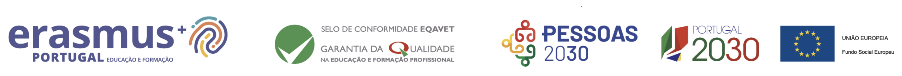

# Linguagens de Programação: 11.º IG

Materiais disponibilizados para a turma de Técnico/a de Informática de Gestão, 2026/2027.

## Materiais

- [M10: cadernos, exemplos e bridge](01-programacao-orientada-objetos/README.md)

## Avaliações e enunciados

- [Enunciados](avaliacoes/README.md)

Começa pelo índice do módulo que estás a estudar. Cada caderno contém explicações, exemplos resolvidos e exercícios; podes regressar às explicações enquanto trabalhas.

